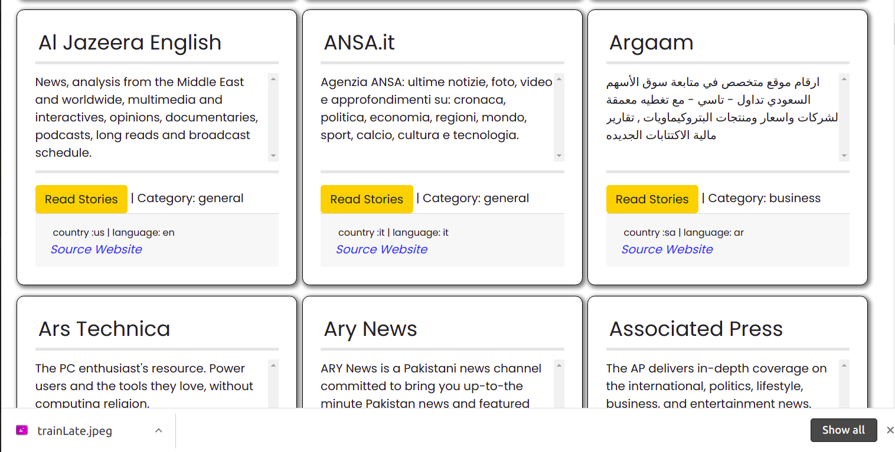

# LateNews
This Website uses the News API to get and update its contents.
The application has been made using Flask micro-framework

The application shows different news sources on the homepage which when clicked, a user sees the news posted by the source. A user can see the articles titles, description and content. To read more of the story a user is redirected to the source website.

# User journey.
A user visits the site.
|--A user sees news sources on Homepage.
| |--A user selects a source to view articles.
|   |--A user views articles can be directed to the source website for more.
|--A user Goes back to homepage using the navbar.

# Output
A user selects a news source to see the articles created by the source.

A user reads an articles and get redirected to source website

# Homepage

# Source Articles Page

## Installation
Have Python installed in you machine.

install pip

install and activate virtual environment

install flask in the virtual environment

Use git, Github and any editor or IDE to see the codes and the rendered frontend.

The execution is done in terminal. Either computer Terminal or IDE terminal

## Usage

Ensure you have Python installed in your machine. Clone this github repository, git pull to your local machine and code away.

## Contributing
Pull requests are welcome. For major changes, please open an issue first to discuss what you would like to change.

Please make sure to update tests as appropriate.

## Website's link
This aplication is hosted heroku. Website Link is 

## License
This Website uses MIT LICENSE. For more Read License.

Copyright (c) 2021 Caleb Odinga